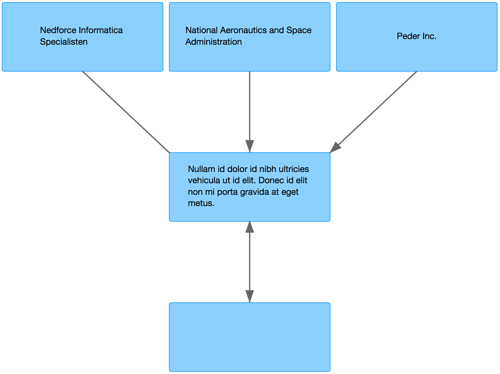
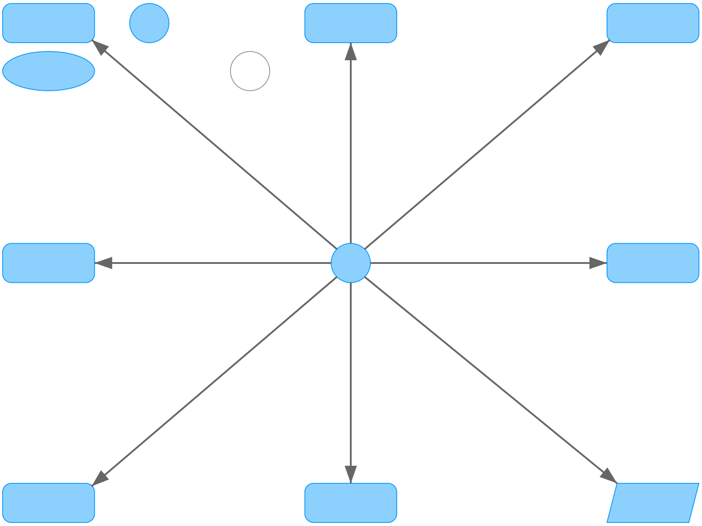
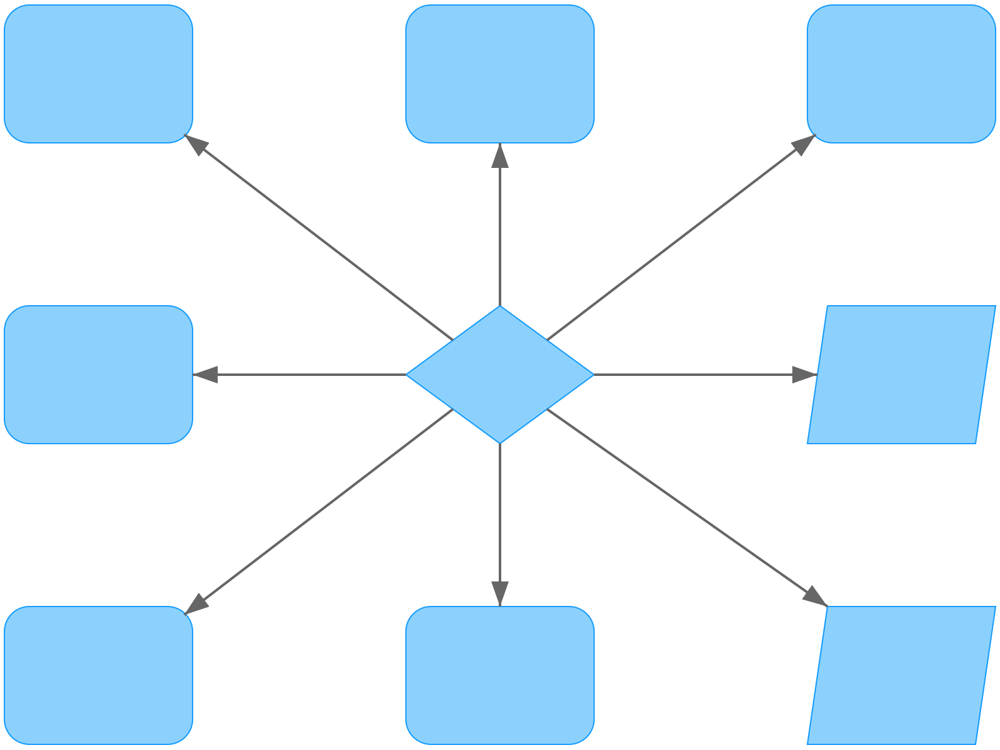

# snappy-diagrams

An arrows-and-boxes diagram builder using Snap.SVG.

## Screenshots

A simple diagram showing boxes with multiline text labels and three different line styles.



A diagram showing a variety of shapes and rounded corners.



Another diagram showing a variety of shapes, including the diamond shape.



## Installation

Load Snap.SVG and the snappy-diagrams JS and CSS:

```html
<script src="/vendor/snap.svg.js"></script>
<script src="/dist/snappy-diagram.js"></script>
<link href="/dist/snappy-diagram.css" media="all" rel="stylesheet" type="text/css">
```

## Usage

*Take a look at the files in the `test` directory to find the implementation of the diagrams shown in the screenshots.*

### 1. Create a new diagram

```javascript
// Generic form: new SnappyDiagram(options);
diagram = new SnappyDiagram({ width: 800, height: 600 });
```

*Supported options:*

<dl>
  <dt>width</dt>
  <dd>The diagram width (px).</dd>
  <dt>height</dt>
  <dd>The diagram height (px).</dd>
  <dt>cellSpacing</dt>
  <dd>The cellspacing between each cell (px).</dd>
  <dt>boxRadius</dt>
  <dd>The border radius of each box (px).</dd>
  <dt>allowDrag</dt>
  <dd>Enables/disables dragging of cells (boolean).</dd>
</dl>

### 2. Add cells to the diagram

```javascript
// Generic form: diagram.add<Shape>(x, y, options);
box           = diagram.addBox(0, 0, { text: 'National Aeronautics and Space Administration' });
diamond       = diagram.addDiamond(1,0);
parallelogram = diagram.addParallelogram(0,1);
ellipse       = diagram.addEllipse(0,2);
circle        = diagram.addCircle(2,0);
```

Cells always have a given position in a grid of which its dimensions are based on all given cell coordinates. The first two arguments of every call are respectively the `x` and `y` position of the new cell.

*Supported options:*

<dl>
  <dt>text</dt>
  <dd>The cell text. It will be multilined and centrally positioned automatically.</dd>
  <dt>class</dt>
  <dd>Additional class name for the cell.</dd>
</dl>

*Except for the cell text, all other given options will be passed directly as HTML attributes to the cell. The `class` option is an example of this.*

### 3. Add connectors to the diagram

```javascript
// Generic form: diagram.addConnector(from, to, options);
diagram.addConnector(box, diamond, { style: 'line', startAnchor: 'middle-right' });
diagram.addConnector(diamond, parallelogram);
diagram.addConnector(parallelogram, ellipse, { endAnchor: 'bottom-right' });
diagram.addConnector(ellipse, circle, { style: 'double' });
```

*Supported options:*

<dl>
  <dt>style</dt>
  <dd>
    <ul>
      <li>'line', no arrows</li>
      <li>'double', arrows in both directions</li>
      <li>By default, a directed arrow will be created from the source cell to the target cell.</li>
    </ul>
  </dd>
  <dt>startAnchor / endAnchor</dt>
  <dd>
    Each cell has 8 different anchor positions. You can explicitly define to which anchor each connector should attach. When not specified, a best guess will be made.
    Possible values:
    <ul>
      <li>'top-left'</li>
      <li>'top-middle'</li>
      <li>'top-right'</li>
      <li>'middle-left'</li>
      <li>'middle-right'</li>
      <li>'bottom-left'</li>
      <li>'bottom-middle'</li>
      <li>'bottom-right'</li>
    </ul>  
  </dd>
</dl>

### 4. Draw the diagram

```javascript
diagram.draw();
```

### 5. Export your diagram

You can export your diagram to PNG by calling the `export` function (supported for in modern browsers and IE10+):

```javascript
window.onload = function() {
  document.getElementById('export-button').onclick = function(){ diagram.export() };
};
```

### Note on Patches/Pull Requests

* Fork the project.
* Make your feature addition or bug fix.
* Add tests for it. This is important so I don't break it in a
  future version unintentionally.
* Commit, do not mess with version, or history.
* Send me a pull request. Bonus points for topic branches.

### Copyright

Copyright &copy; 2015 Reinier de Lange &amp; Peter Leppers. See LICENSE for details.

